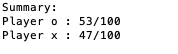
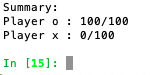

```{r setup, include=FALSE}
knitr::opts_chunk$set(echo = TRUE)
getwd()

```

### AI Agent A

This is our baseline agent using weights trained from code https://github.com/awni/backgammon. We used 50000 games to train with a gamma of 0.7 and alpha of 0.1. The neural network has an input layer of 294 nodes and a single hidden layer of 50 nodes. It uses a sigmoid activation function. 

We implement the agent by writing three different functions. (The code for these functions is in the ai_agent.R file)

##### 1. A function that translates the board configuration into a feature vector of length 294.

```{r, echo=TRUE}
#source('./backgammon_shiny/ai_agent.R')

findFeat <- function(boardF, player){
    features = c()
for (p in 1:2){
    for (col in 1:24){
      feats = c(0,0,0,0,0,0)
      if (boardF[col] > 0 && p == 1){
        # player 1 has pieces
        for ( i in  1:boardF[col]){
          feats[min(1+i,6)] = feats[min(1+i,6)] + 1
        }
       features = c(features, feats)
      }
      else if (boardF[col] < 0 && p == 2){
        for ( i in  1:abs(boardF[col])){
          #python is 0 indexed!
          feats[min(1+i,6)] = feats[min(1+i,6)] + 1  
        }
        features = c(features, feats)
      }
      else{
        features = c(features, c(0,0,0,0,0,0))
      }
    }
  # 25=white bar, 26=white off, 27=black off, 28=black bar
  # bar and off board
  if (p == 1){
  features = c(features, boardF[25]/2.0, boardF[26]/15)
  }
  if (p == 2){
  features = c(features, boardF[28]/2.0, boardF[27]/15)
  }
}
    # which player player
    if (player){
      features = c(features, 0, 1)
    }
    else {
      features = c(features, 1, 0)
    }
  return(features)
}

```

##### 2. A feedforward function takes the feature vector and already trained weights and calculates the probability that a board configuration would win.

The code we used to train this AI was in python so the final weights were exported to a csv to use them in the R Shiny framework.

```{r}
win_prob <- function(boardF, player){
  # get features
  feat = array(findFeat(boardF, player),dim = c(294,1))
  w1 = as.matrix(w1.in)  # 50 by 294
  b1 = as.matrix(b1.in)  # 1  by 50
  w2 = as.matrix(w2.in)  # 50 by 1
  b2 = as.matrix(b2.in)  # 1 by 1
  
  # z = 50x1 + 50x294 * 294x1
  z = t(b1) + w1 %*% feat
  
  # h = 1 + 1x50 * 50x1
  h = b2 + t(w2) %*% sigmoid(z)
  
  # returns prob of winning given board configuration
  return(sigmoid(h))
}
```

##### 3. A move function that takes the player, board configuration, and dice roll and outputs the optimal moves for the AI. 


```{r}
# given board configuration and roll find best move
ai_move <- function(boardF, roll, player){
  if (playerB){
    moves=find.all.possible.moves(flip.board(boardF),roll)
    v = 0
    for (i in 1:length(moves)){
      p = win_prob(moves[[i]], player)
      if (p>v){
        v = p
        best = moves[[i]]
      }
    }
    return(flip.board(best))
  }
  else{
    moves = find.all.possible.moves(boardF, roll)
    v=0
    for (i in 1:length(moves)){
      p = win_prob(moves[[i]], player)
      if (p>v){
        v = p
        best = moves[[i]]
      }
    }
    return(best)
  }
}
```

##### Evaluating AI Agent A

First, we have two random agents play each other. Player O wins 53/100 games and Player X wins 47/100 games.



Then we have the random agent (Player X) play the TD agent (Player O). The TD agent wins 100/100 of the games.





This analysis was done using the python framework developped in https://github.com/awni/backgammon. Some sample python code we used for the analysis is below.
```{r}
# weights = pickle.load(open('weights0.bin','r'))
# p2 = agent.RandomAgent(game.Game.TOKENS[1])
# p1 = aiAgents.TDAgent(game.Game.TOKENS[0],weights)
# test([p1,p2],numGames=100,draw=False)
```


### The GUI

We implemented the TD Gammon algorithm to play against a human.

- Use Shiny R package for interactive web apps
- Make an interactive game board that follows the rules of Backgammon 

Players

- Human
- Random Turn
- AI Agent A & B

For any given board configurations the AI Agent takes a set of pretrained weights and uses a feed forward functinon to determine which move out of it's set of possible moves gives it the highest probability of winning. 

The random turn takes the current board configuration, dice roll, and player and returns a random legal move for that player. 

 

##### Key features we implemented in the GUI:

- Restricts humans to the set of legal moves on a given turn.
- Automatically sends pieces to bar.
- Tracks the possible moves left for human.
- Popup message notifies when game is over.
- Popup message notifies when there are no possible moves for AI/Random
- Spacing of pieces on the board adjusts so that regardless of number of pieces on a given point they all fit. 

We have published the GUI online using the free R Shiny App Server: https://fionapaine.shinyapps.io/backgammon_shiny/ 


