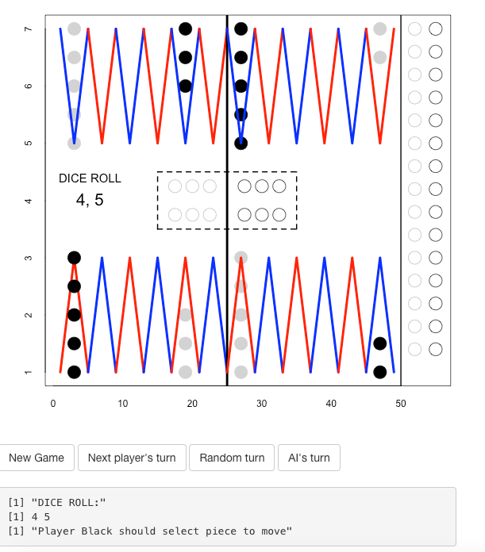

```{r setup, include=FALSE}
options(htmltools.dir.version = FALSE)
# find.image searches subdirectories for partial match of argument. Useful when some images are dynamically generated
find.image=function(name){grep(name,list.files(recursive = TRUE),value=TRUE)}

# Example of how to use find.image to display an image
#`)

```


# TD Gammon 

TD Gammon<sup>1</sup> is a a neural-network based algorithm that plays backgammon at a near expert level.
--

- Developed by Gerald Tesauro in 1992
--

- Uses temoral-difference learning & eligibility trace to update
--

- Begins with no strategy knowledge


---

# Backgammon Game Setup


--

- 15 white pieces, 15 black pieces
- 24 board locations (called points)

--

*The objective is to get all your pieces home*

---

# Backgammon Game Play


--

- Each turn a player rolls two die
--

- Each player is moving in the opposite direction
--

- The number of steps a piece can be moved is exactly the number on die
--

- Can't move to a point with 5 pieces (its considered full)
--

- Can't move to point with more than one piece of the opposite color
--

- If there is only one piece of opposite color send that piece to "bar" 
--

- Once all pieces are on home board they can start "bearing off"
--

- First player to get all pieces off board wins!

---
# Backgammon Complexity

Backgammon is an interesting game for AI because of its complexity and probabilistic elements... it's not purely strategy based!

--

Trying to take into account all possible board configurations and all possible future dice rolls is way too computationally intensive.... game has effective branching factor of about 400!

--

Conclusion: Search methods like those used in chess and checkers are impossible.

--

*Fun Fact: Because it is partly a game of chance Backgammon is used to bet money and there are more professional Backgammon players than professional chess players!*

---
# The Algorithm 

The neural network is a *value function* that should be able to predict, given any board configuration, the realtive advantage of each player.
--

### Heuristics:
--

- We only know the *actual* relative advantage at the end of the game (win = 1, loss = 0.)
--

- Want to minimize the difference between the value before the turn and after 
--

  + **Idea**: At the end of the game we can calculate error: 1 - *calculated value from previous turn*. Can we backpropegate this? 
--

- Yes. However, moves leading up to the end of the game influence the later position -- you can't just back propegate error once at the end. 
--

  + **Problem**: How can we continually update the value function, not just once at the end, even though we don't have an absolute value unless it's a win or loss? 

---

# The Algorithm (cont.)

### Backprop weight updates

 .content-box-blue[
  $$W_{t+1} = W_{t} + \alpha \frac{\delta C_t}{\delta W_t} \\ b_{t+1} = b_{t} + \alpha \frac{\delta C_t}{\delta b_t}$$ where *t* is an increment of time. 
 ]

--

### Issue 
Only take into account current gradient. In this application, want to remember previous moves as well.
---

# Eligibility Traces


 .content-box-blue[
  $$e_t = \lambda e_{t-1} + \frac{\delta C_t}{\delta \theta_t}$$ where $\theta$ is any adjustable parameter.
  ]

---

# Eligibility Traces (cont.)

### Let's unpack that:

.content-box-blue[
$$\\ e_0 = 0 \\ e_1 = 0 + \frac{\delta C_1}{\delta \theta_1} \\ e_2 = \lambda(\frac{\delta C_1}{\delta \theta_1}) + \frac{\delta C_2}{\delta \theta_2} \\ e_3 = \lambda[\lambda(\frac{\delta C_1}{\delta \theta_1}) + \frac{\delta C_2}{\delta \theta_2}] + \frac{\delta C_3}{\delta \theta_3}$$
]

---

# Tuning

Now, we have an algorithm that takes into account the move history, using hyperparameter $\lambda$ to weigh recent moves more heavily. 
--


#### Using $\lambda = 0$, 
$$e_t = 0 *e_{t-1} + \frac{\delta C_t}{\delta \theta_t} = \frac{\delta C_t}{\delta \theta_t}$$
--

**Result**: Mostly looks at recent game states. 
--


#### Using $\lambda = 1$,
$$e_t = 1 *e_{t-1} + \frac{\delta C_t}{\delta \theta_t} = 1 * [1*(\frac{\delta C_1}{\delta \theta_1}) + \frac{\delta C_2}{\delta \theta_2}...] + \frac{\delta C_t}{\delta \theta_t} \\= \frac{\delta C_1}{\delta \theta_1} + \frac{\delta C_2}{\delta \theta_2} + ... + \frac{\delta C_n}{\delta \theta_n}$$
--

**Result**: Counts all game states equally. 

---


# The Algorithm (cont.)

### Error Value
 .content-box-blue[
  $\text{Error}=V_t(s_{t+1})-V_t(s_t)$ 
  where $V_{i}$ = 0,1 if $i$ is the final move, and $V$ is the value of the network output.
 ]

--

### New weight updates

 .content-box-blue[
  $$\theta_{t+1} = \theta_{t} + \alpha * \text{error} * e_t$$
 ]


---
# Tesauro's Implementation Details
Tesauro did not give full details of his algorithm. However, we know the basics:<sup>5</sup>
--

- Network size: three layers (one hidden layer)
--

- Hidden layer size: 40 nodes
--

- Games played: 200,000
--

- Learning rate (alpha): 0.1
--

- Decay (lambda): 0.8
--

- Sigmoid activations

--

## Some Unknowns

- What other things did he experiment with? 
--

- Did he wipe eligibility traces? 
--

- etc.


---

# Our GUI 

Implementing the TD Gammon algorithm to play against a human.

--

- Use Shiny R package for interactive web apps

--

- Make an interactive game board that follows the rules of Backgammon 

--

Players
- Human
- Random Turn
- AI Agent(s)

--

For any given board configurations the AI Agent takes a set of pretrained weights and uses a feed forward functinon to determine which move out of it's set of possible moves gives it the highest probability of winning. 

---



---
# Testing our TD-gammon algorithm

*There are many different variations on how to implement the TD-gammon algorithm*

--

- Run implemented TD-gammon algorithm (from github) to get weights (in python)

--


- Write matching feed forward agent that takes board configuration and weights and outputs best move (in R)


---

# Current State of the Algorithm 
- Spent time working with TensorFlow, haven't gotten it to work 
--

- Implementing using Vanilla R 
--

- Have downloaded and trained another implementation that we will play against ours 
--

- Challenges:
--

  + Use of Objects in R is new
--

  + Focus on good, readable code and architecture
--
  
  + Training intensive algorithm
--

  + Many possible variations, every online source does it slightly differently

---

# Plans
Ideas for experimentation with the algorithm:
--

- Adding multiple hidden layers 
--

- Using Relu instead of sigmoid 
--

- Using varying numbers of nodes in hidden layer 
--

- Using momentum or other tuning strategies to try to improve performance


---
# Sources 
[1] [Tesauro's Original Paper](http://modelai.gettysburg.edu/2013/tdgammon/pa4.pdf)

[2] [Stanford Paper comparing Td-gammon to a Baysean approach](http://cs229.stanford.edu/proj2013/MolinFlyhammarBidgol-UsingMachineLearningToTeachAComputerToPlayBackgammon.pdf)

[3] [Cornell Article with good pseudocode](https://www.cs.cornell.edu/boom/2001sp/Tsinteris/gammon.htm)

[4] [Helpful medium article with link to tensorflow explination](https://medium.com/jim-fleming/before-alphago-there-was-td-gammon-13deff866197)

[5] [Class assignment with some Java pseudocode](http://modelai.gettysburg.edu/2013/tdgammon/pa4.pdf)


---


# Questions? 


