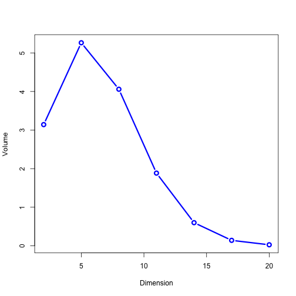

```{r setup, include=FALSE}
options(htmltools.dir.version = FALSE)
# find.image searches subdirectories for partial match of argument. Useful when some images are dynamically generated
find.image=function(name){grep(name,list.files(recursive = TRUE),value=TRUE)}

# Example of how to use find.image to display an image
#`)

```

# TD Gammon 

## Sally todo
TD Gammon is a an algorithm that plays backgammon at a near expert level.

- Developed by Gerald Tesauro in 1992
- Uses temoral-difference learning 

---

# Backgammon Rules
## Fiona todo
---

# Background Research 
## Sally todo

---


# Algorithm Mechanics

## Sally todo
---


# Our GUI 
## Fiona todo

---


# Current State of the Algorithm 
## Sally todo

---


# Plans
## Fiona & Sally todo

---


# Xaringan

The following slides give examples of how to use Xaringan to format presentation slides. It isn't a template for your presentation, but it should help speed up preparation for Wednesday.

If you examine this `Rmd` file you will see that slides are separated by a line starting with three dashes: `---`. It's that easy.

Most slides start with a title. Titles are lines that begin with a single hash: `#`. It's that easy.

Line returns are not meaningful.
This line will continue right after the previous even though there is a line return after the first line.

You need an empty line to start a new paragraph.

*This is an italic line*

**This is a bold line**

This line uses embedded `R-code` to calculate $\pi=`r pi`$. That's `R-code` embedded inside inline $\LaTeX$. 


---

#Xaringan

You should be able to install Xaringan using RStudio `Tools->Install Packages`. If that doesn't work use the following code chunk:

```{r eval=FALSE, tidy=FALSE}
devtools::install_github("yihui/xaringan")
```

Here's a [link](https://slides.yihui.name/xaringan/) to the Xaringan introduction slides.

You can see the `Rmd` file that generates the Xaringan intro slides by creating a new Xaringan presentation in RStudio as follows:

`File -> New File -> R Markdown -> From Template -> Ninja Presentation`

Use `UTF-8` when saving the Ninja Presentation. 

These slides and the Xaringan introduction slides should cover everything you need.

---
# Image with Related Quote/Footnote

.medium[
>Speaking with Axios on the sidelines of an AI conference in Toronto on Wednesday, Hinton, a professor emeritus at the University of Toronto and a Google researcher, said he is now "deeply suspicious" of back-propagation, the workhorse method that underlies most of the advances we are seeing in the AI field today, including the capacity to sort through photos and talk to Siri. "My view is throw it all away and start again," he said<sup>1</sup>
]

.center[  ]

.footnote-blue[

[1] Quoted from [Axios](https://www.axios.com/artificial-intelligence-pioneer-says-we-need-to-start-over-1513305524-f619efbd-9db0-4947-a9b2-7a4c310a28fe.html)
]

---

#H1 Size Title

##H2 Size Subtitle

###H3 Size Sub-subtitle

Here's how you bold words and set a footnote reference. The .bold[Xaringan] project is on **GitHub**<sup>1</sup>

If you want to you can .large[.bold[.red[use size and color]]] to make content stand out

Xaringan is intended to be easy and flexible. Xaringan formatted Rmd files are preprocessed by `remark.js` to produce `HTML`. The associated `css` and `js` files allow for customization. If you examine the included `test.css` and `macros.js` files it should be clear how you can add your own custom elements. You will find code for `.large`, `.bold` and `.red` in `test.css`


.footnote-blue[

[1] See [GitHub](https://arxiv.org/pdf/1608.06993.pdf) for xaringan code

]

---
# Customized CSS

The included `test.css` file contains a few useful formatting tools. Here's an example

```
.content-box-blue {
    background-color: #e6f0ff;
    border-radius: 5px;
    padding: 20px;
 }
 ```
 
 You can use this definition to make something stand out. For example, here's the `sigmoid` function:
 
 .content-box-blue[
  $$\sigma(x)=\frac{1}{1+e^{-x}}$$
 
 ]
 
---
# Including Images/Macros.js

Including images can be tedious because of sizing problems. To make things easier there is are `javascript` macros in the file `macros.js` that let you scale an image. Here is the syntax. Note that static images should go in the `./images` folder.

```

```


---

# Default CSS

You can add any definitions you want to the file `text.css`. The Xaringan standard `css` file is `libs -> remark-css -> default.css`. You should not edit this file, but  it contains many useful definitions. For example, `.pull-left` and `.pull-right` are demonstrated below

```
.pull-left {
  float: left;
  width: 47%;
}
.pull-right {
  float: right;
  width: 47%;
}
```

.pull-left[
.green[ **Left Side** ] 

]

.pull-right[
.blue[ **Right Side** ]
]

---
#Including Images 2

Now use `.pull-left, .pull-right` to include images side-by-side

.pull-left[
**PCA separation of MNIST data**


]

.pull-right[
**PCA separation of layer 4 activations (MNIST input)**

]


---


#Example Slide/Lists with builds

###Numbered List with build
Build elements are separated by lines that start with two dashes: `--`. During your presentation the `down-arrow` key will advance the build

1. first numbered item
  + sub item
--

1. second numbered item
--

1. third item

--

###Un-numbered list without build

- first un-numbered item
  + sub item
- second un-numbered item

---
#Dynamic Plots

`R-code` can be used to dynamically compute a plot. Dynamically generated plots are saved in `<rmd_file_name>_files -> figure-html`. The file name is the code chunk name followed by a hyphen and a graph number. 

It's good practice to separate plot generation from plot display. The code below will create a `png` file called `xlnx-1.png`. Because `fig.show="hide"` it won't be displayed. The resulting graph is displayed twice on the next slide.


```
{r xlnx,echo=TRUE,fig.show="hide",fig.width=7,fig.height=3}
pars=par(no.readonly = TRUE)
par(mar=c(4,4,1,.1))
grid=seq(0,1,length.out = 100)
plot(grid,grid*log(grid),ylab="x*log(x)",xlab="x",ylim=c())
par(pars)
```

```{r xlnx,echo=FALSE,fig.show="hide",fig.width=7,fig.height=3}
pars=par(no.readonly = TRUE)
par(mar=c(4,4,1,.1))
grid=seq(0,1,length.out = 100)
plot(grid,grid*log(grid),ylab="x*log(x)",xlab="x",ylim=c())
par(pars)
```

---

# Left-Right Plots

On this slide the plot generated previously is displayed. The left side uses inline `R-code` to find the image. The right side uses explicit file naming.

.pull-left[

.content-box-blue[
  `)
]
]

.pull-right[

.content-box-green[
  
]
]

---

```{r dvol, fig.show="hide", echo=FALSE}
#compute some sphere volumes
N=20
dims=seq(2,N,by=3)
v=numeric(length(dims))
vol=function(d){(pi^(d/2))/(d*gamma(d/2)/2)}
for(i in 1:length(dims)){
  d=dims[i]
  v[i]=(pi^(d/2))/((d/2)*gamma(d/2))
  #print(paste(v[i],vol(d)))
}
plot(dims,v,type="b",lwd=3,col="blue",cex=1.25,xlab="Dimension",ylab="Volume")
```

#Table Example

.pull-left[


]

.pull-right[
```{r fig.show="hide", echo=FALSE}
suppressWarnings(require(knitr,quietly = TRUE))
suppressWarnings(require(kableExtra,quietly = TRUE))
df=data.frame(dim=dims,vol=v)
kable(df,format = "html")
```
]

- Distance to corner of cube grows as $\sqrt{d}$.  For $d>4$ the cube corners extend past the unit sphere.

- Because factorial grows faster than exponential $\operatorname{Vol}(S^d) \rightarrow 0$ as $d \rightarrow \infty$

**Note:** $\Gamma (n)=(n-1)!$

---
#Diagrams

There is an easy to use online graphical editor for diagrams. I used [mathcha](https://www.mathcha.io/) for all the diagrams in my slides. Once you create a diagram you can download using the **`image`** button at the top of the editor. Some recommendations

- Select **`png`** for download format
- Check **`Background Transparent`** and **`No Grid`** in the **`image`** dialogue
- After downloading use a tool like paint to tightly crop the image

**Example**
.center[  ]

---

#Rayleigh Quotient

.pull-left[
For real symmetric A

$$R(A,\mathbf{y})= \frac{\mathbf{y}^T A\mathbf{y}}{\mathbf{y}^T \mathbf{y}}$$
$$\min_{\mathbf{y}}{R(A\mathbf{y})}=R(A,v_{min}(A))=\lambda_{min}$$
$$\max_{\mathbf{y}} R(A\mathbf{y})=R(A,v_{min}(A))=\lambda_{max}$$
]

.pull-right[


]


---

#MNIST Reconstruction

.pull-left[
**10 Eigen Digits**

]

.pull-right[
**64 Eigen Digits**

]
  
---

#Stochastic Neighbor Embedding

**SNE**<br>
Map high-dimensional data points to two or three dimensions for visualization
- If high-dimensional data lie on a low dimensional manifold, want to preserve that structure.<br>
- PCA will preserve low dimensional manifold only if it is linear.<br>
- SNE tries to preserve 'neighborhoods' without explicitly learning the manifold.<br>


---

#SNE
.pull-left[
Let $\mathbf{x}^{(i)}, i=1, \cdots,m$ be points in a high dimensional space $\mathbb{R}^d$

Create proximity measure for each point

$$x_{ij}^2=\left \| x^{(i)}-x^{(j)} \right \|^2$$

]

.pull-right[

To emphasize nearness, map distances using exponential

$$p_{j | i}= \frac{e^{- {x_{ij}^2}/({2 \sigma_i^2})}}{\sum_{k \neq i} e^{-{x_{ik}^2}/({2 \sigma_i^2})}}$$
<br><br>
**Note:** have softmax'd the vector $-{x_{ij}^2}/{(2 \sigma_i^2)}$ for $j \neq i$ to create probability distribution for each $i$

<br>
[Stochastic Neighbor Embedding, Hinton, Roweiss (2002)](https://cs.nyu.edu/~roweis/papers/sne_final.pdf) by Hinton, Roweis

]


